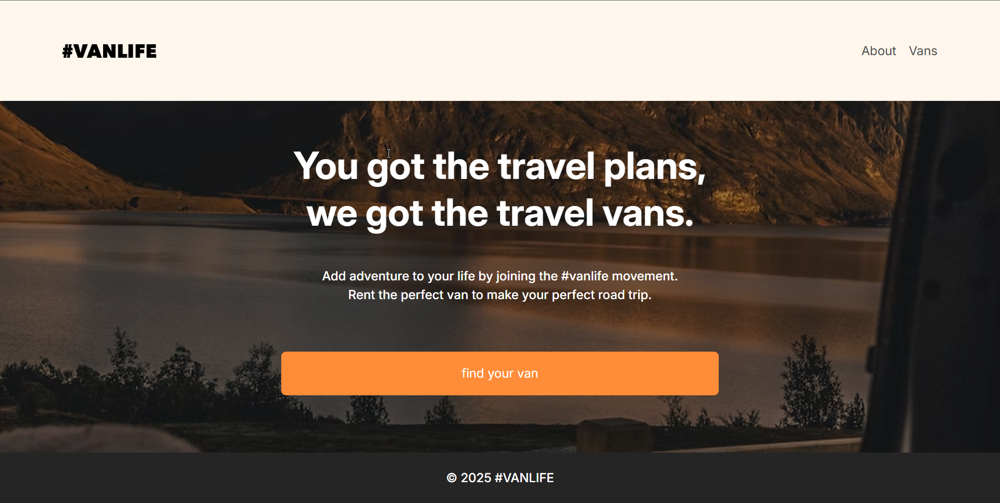
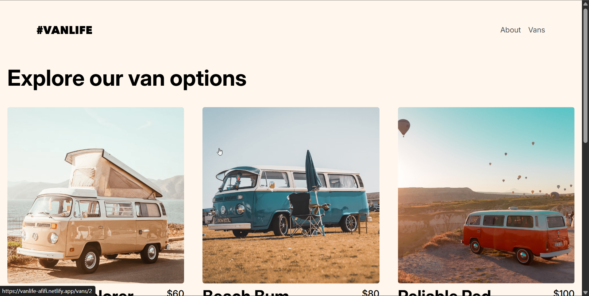

# vanlife
Van rental UI built with React and Vite.

## One-line pitch

vanlife — A React, Vite, TailwindCSS, MirageJS van‑rental UI with nested routing, dynamic filters and demo/mock data.

## Demo

Add your deployed demo link here (Vercel / Netlify) — e.g. `https://vanlife.example.com`

## Screenshots
___

___

___

## Features

- Nested routing (listing → details → booking)
- Dynamic filtering and search
- Responsive UI (mobile-first)
- Mock API for demo data (if present)

## Tech Stack

React, Vite, TailwindCSS, MirageJS

## Project structure (top-level)

- `.gitignore`
- `README.md`
- `eslint.config.js`
- `index.html`
- `package-lock.json`
- `package.json`
- `public/`
- `src/`
- `vite.config.js`

## Detected insights

- React detected: True
- Next.js detected: False
- Vite detected: True
- TypeScript detected: False
- Tailwind detected: True
- Mirage/mock-api detected: True

## How to run (guess)

```bash
# install
npm install
# dev
npm run dev
# build
npm run build
# preview
npm run preview
```

## Suggested improvements

- Add a deployed live demo (Vercel / Netlify) and include the link in README.
- Add screenshots or a GIF showing main flows (search, filters, van detail).
- Add a clear Tech Stack section and 'How I contributed' if this was collaborative.
- Improve README installation steps (node version, env vars) and add an example data flow.

## Components sample (first 20 found)

- `src/components/Footer.jsx`
- `src/components/Header.jsx`
